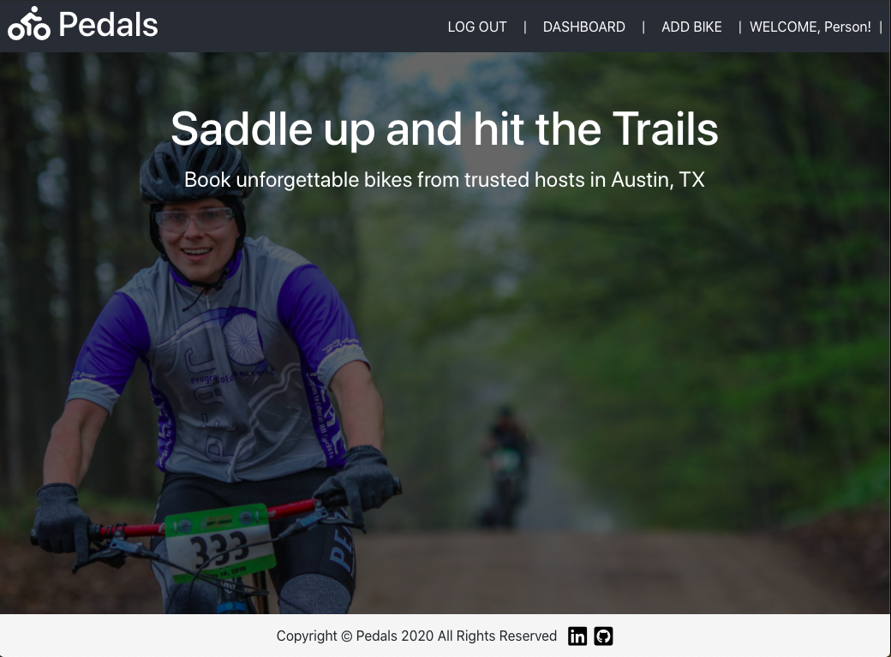
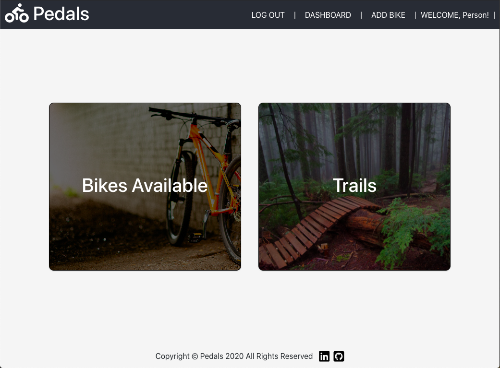
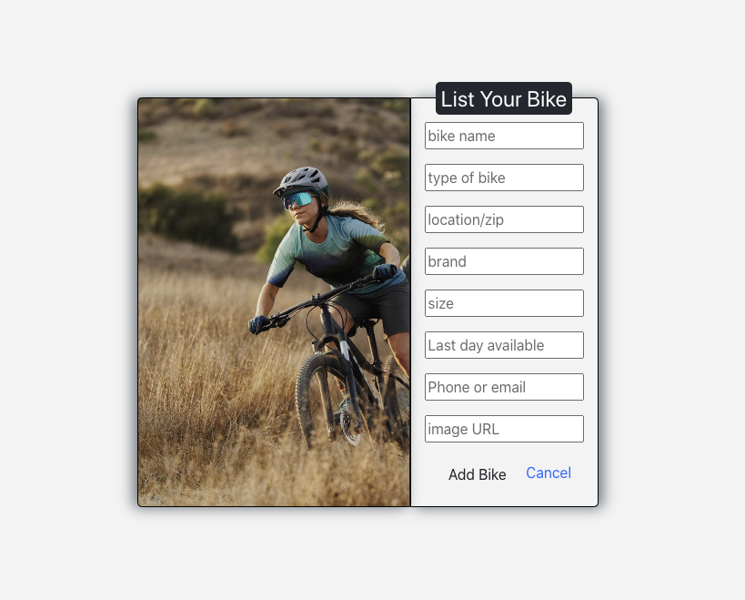
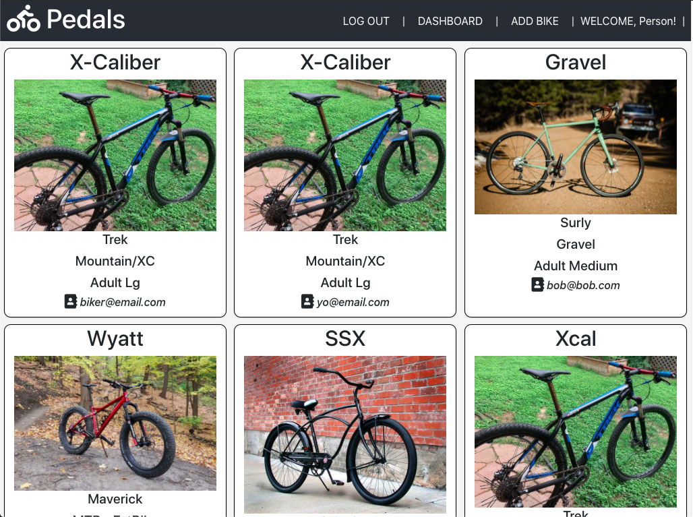
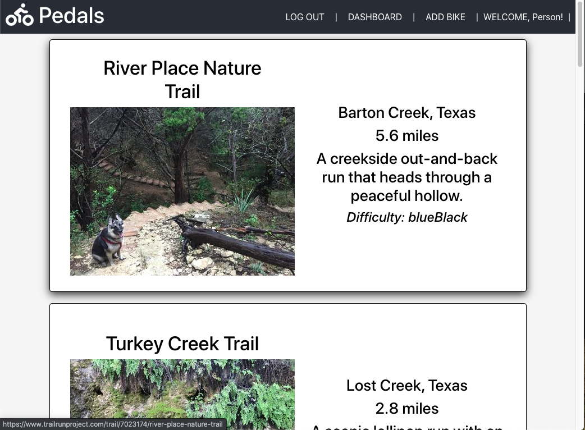
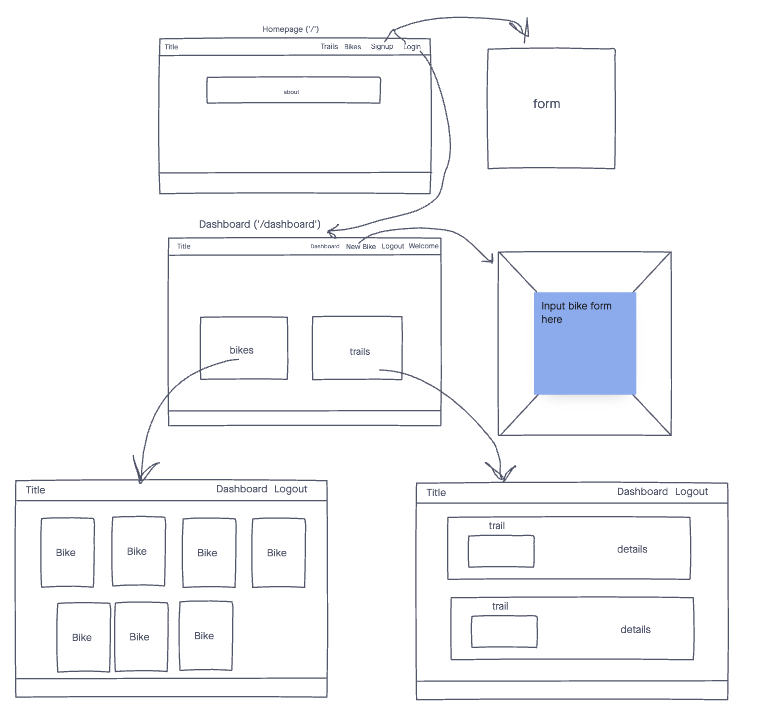

# Pedals

## Technologies Used

- React.js
- Javascript
- CSS3
- HTML5
- FontAwesome
- Bootstrap
- Trails API
- Bikes API (Mongoose, Node.js & Express backend)
- AJAX
- MongoDB
- Token Based Auth

## Screenshots

### Home Page:

### Dashboard:

### Add Bike Page:

### Bikes Page:

### Trails Page:

## Wireframes

## Getting Started

[Click Here]() to see the deployed app.

## Future Enhancements

- open it up to more cities
- upload pictures rather than URL
- Update & Delete functionality
- messaging within the app
- reserving within the app
- adjust styles for small screens
- use modal or add page for bike clicked on with dates available and price per day
